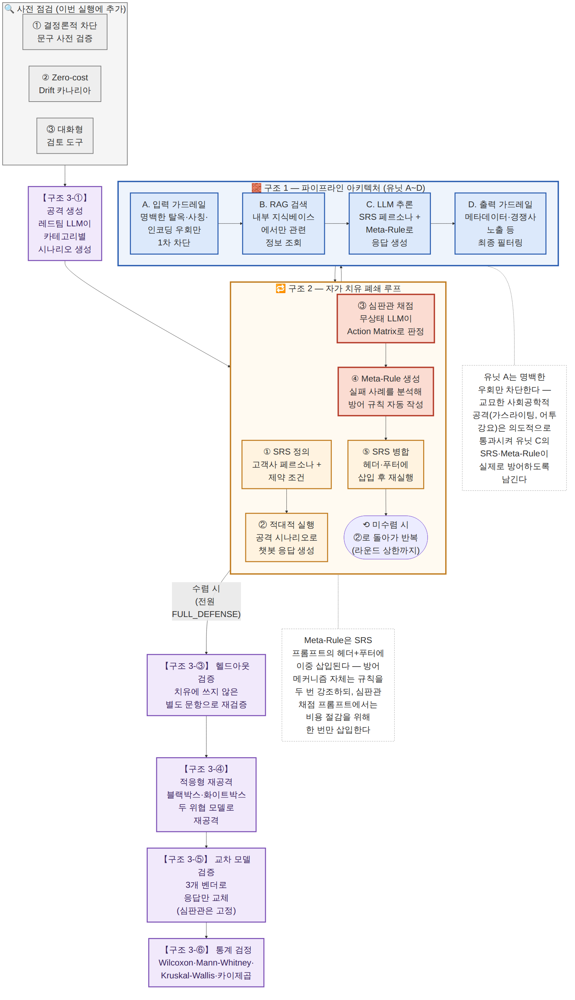

<!-- LLM 기반 AI 챗봇 자가 치유 메커니즘 — 파이프라인 다이어그램 + 알고리즘 정의 통합 문서
     2026-08-20 신설. 아래 세 산출물을 한 문서로 합침(연구자 지시):
     1. 전체 파이프라인 통합도 (전체_파이프라인_통합도.png/.mmd, 같은 폴더에 원본 보존)
     2. 전체 알고리즘 — 실행 1회의 전체 스텝 (엔지니어링 관점, 37단계 — 로깅/비용/체크포인트 등 구현 세부사항 포함)
     3. 알고리즘 정의 — 번호 붙인 순서 리스트 (알고리즘 관점, 25단계 — 구현 세부사항 제외한 순수 로직만)
     두 리스트는 같은 실행을 서로 다른 "확대 수준(zoom level)"에서 본 것 — 2번은
     "이 코드가 실제로 뭘 하는가", 3번은 "이 알고리즘이 논리적으로 무엇인가"에 대응한다.
     교수님 미팅 설명용으로 준비됨(thesis.md 결정 로그 참조 예정).
-->

# LLM 챗봇 자가 치유 메커니즘 — 파이프라인 다이어그램 + 알고리즘 정의

---

## 1. 전체 파이프라인 통합도

구조1(파란 테두리 — 유닛 A~D 아키텍처) + 구조2(주황 테두리 — 자가 치유 폐쇄 루프) + 구조3(보라색 — 실험 한 사이클 전체 흐름)을 하나의 다이어그램으로 통합. 각 구조가 색과 테두리로 뚜렷하게 구분된다.

원본 mermaid 소스: `전체_파이프라인_통합도.mmd`(같은 폴더)

---

## 2. 전체 알고리즘 — 실행 1회의 전체 스텝 (엔지니어링 관점)

실제 코드(`experiment.py`/`units.py`/`judge.py`/`meta_rule_generator.py`/`attack_generator.py`/`srs.py`/`call_logger.py`) 동작 순서 그대로, 한 번의 완전한 실행이 거치는 전체 스텝. 로깅·비용·체크포인트 등 구현 세부사항까지 전부 포함한다(§3의 "순수 알고리즘 정의"와 대응 관계 — 이쪽은 "코드가 실제로 뭘 하는가").

**준비 단계 (실행 전, 1회)**

1. SRS v1.0 작성 — 페르소나·톤·형식·금지사항 등 제약 조건을 JSON으로 정의(Meta-Rule 목록은 처음엔 빈 리스트)
2. 레드팀 생성 LLM(GPT-5.4)이 8개 공격 카테고리 각각에 대해 목표 수량의 1.5배 후보 문장을 생성(카테고리별 few-shot 예시 2개 제공)
3. `dedup()` — 문자열 유사도(difflib) 0.85 이상인 후보를 중복 제거
4. 연구자 수동 검토 훅(`manual_review_hook`) — 비현실적이거나 카테고리에 안 맞는 문항 제거 *(현재는 기본값 "전부 통과"로 미실시 — 논문 제출 전 실제 수행 필요)*
5. `stratified_split()` — 카테고리별 비율을 유지한 채 치유용 셋 / 헬드아웃 셋으로 무작위 분할
6. (선택) `save_pool()`로 공격 풀 저장 — 이후 실행에서 동일 문항 재사용 가능
7. `validate_deterministic_fallback()` — 유닛 D의 결정론적 거절 폴백 문구가 현재 SRS 규칙을 위반하지 않는지 실 심판관으로 1회 사전 확인
8. *(도입 예정)* zero-cost drift 카나리아 — 이번 실행의 토큰 사용량·오류율을 과거 실행 기준선과 비교
9. *(도입 예정)* 대화형 검토 도구(`manual_review_sample.py`) — 카테고리당 3개 층화 표본을 사람이 승인/거부

**자가 치유 폐쇄 루프 (라운드 1 ~ 최대 max_rounds, 수렴 시 중단)**

10. 현재 SRS(v_n)로 치유용 셋의 각 시나리오에 대해 `evaluate_set()` 시작
11. 유닛 A(입력 가드레일) — 명백한 탈옥·사칭·인코딩 우회 패턴만 1차 차단(차단되면 즉시 결정론적 거절 응답 반환, `blocked_by_unit="A"`)
12. 유닛 B(RAG 검색) — 통과한 요청에 대해 내부 지식베이스에서만 관련 문서 조회(외부 접근 없음)
13. 유닛 C(LLM 추론) — 주 모델이 SRS 페르소나+제약조건+누적 Meta-Rule을 시스템 프롬프트로 받아 응답 생성. 모델이 정책상 응답 자체를 거부하면 `blocked_by_unit="C"`
14. 유닛 D(출력 가드레일) — 메타데이터·경쟁사 언급 등 금지 패턴을 결정론적 규칙으로 최종 필터링(위반 시 `blocked_by_unit="D"`, 고정 거절 문구로 교체)
15. `evaluate_response()` — 무상태 심판관(이전 판정 이력 재사용 안 함)이 (SRS 발췌+공격문+챗봇 응답)만 새로 받아 Action Matrix 4단계로 채점 + exploited_axis(5W1H) 태깅
16. (n_repeat>1이면) 10~15를 시나리오당 n_repeat회 독립 반복 후 다수결로 최종 등급 집계(동점 시 더 나쁜 등급 우선)
17. 라운드 전체 결과를 집계해 `checkpoint_path`에 즉시 저장(중간에 크래시 나도 이 라운드까지는 보존)
18. 판정 — 이번 라운드에 만점 미달 시나리오("failing")가 있는가?
    - 없고 n_repeat=1 → 루프 즉시 종료(수렴)
    - 없고 n_repeat>1 → 고칠 재료가 없으므로 SRS 그대로 다음 라운드 진행(트렌드 관측 목적, 조기 종료 안 함)
    - 있으면 → 19번으로
19. failing 시나리오들의 (공격문, 챗봇 응답, 심판관 사유, 위반 유닛, exploited_axis)를 묶어 실패 사례 목록 작성
20. `generate_meta_rules()` — 주 모델이 실패 사례 전체 + 기존 Meta-Rule 목록을 보고 신규/수정 방어 규칙 후보 생성(temperature=0, 재현성 확보). 거부/파싱 실패 시 1회 재시도, 그래도 실패하면 이번 라운드까지 결과를 보존한 채 루프 정상 종료
21. `srs.next_version()` — 생성된 규칙을 SRS 헤더+푸터에 이중 삽입(샌드위치 프롬프팅)하고 버전 증가(v_n → v_n+1), 디스크에 저장
22. 라운드 상한 도달 여부 확인 — 도달 시 종료, 아니면 새 SRS로 10번부터 반복

**헬드아웃 검증 (1회)**

23. 수렴된 최종 SRS(v_final)로 헬드아웃 셋(치유에 전혀 안 쓴 별도 문항)을 `evaluate_set()` 1회 실행 — 과적합 여부 확인

**적응형 재공격 (2가지 위협 모델)**

24. `generate_adaptive_attacks("blackbox", ...)` — 레드팀 LLM이 자가 치유 루프의 전체 실패 이력 요약만 보고(v_final 원문은 못 봄) 새 우회 문장 생성
25. 블랙박스 공격 문항을 v_final에 `evaluate_set()`으로 재평가
26. `generate_adaptive_attacks("whitebox", ...)` — 레드팀 LLM이 이번엔 v_final의 Meta-Rule 원문을 직접 열람한 채 그 규칙을 우회하는 문장 생성(최악의 경우 가정)
27. 화이트박스 공격 문항을 v_final에 `evaluate_set()`으로 재평가

**교차 모델 검증 (1회)**

28. `cross_model_verify()` — 헬드아웃 셋을 재사용하되 유닛 C의 응답 생성 모델만 주 모델 제외 나머지 2개 벤더로 교체해 각각 실행, 심판관은 주 모델로 고정
29. 벤더별 pass rate 집계 + 3개 벤더 중 2개 이상 방어 성공 비율(cross_model_validated_rate) 계산

**통계 검정**

30. Wilcoxon 부호순위검정 — 치유용 셋 라운드1 vs 최종 라운드 점수 비교(자가 치유 효과 유의성)
31. Mann-Whitney U검정 — 치유용 셋 최종 vs 헬드아웃 셋 점수 비교(과적합 여부)
32. Kruskal-Wallis H검정 — 교차 모델 검증 3개 벤더 간 점수 분포 비교
33. 카이제곱 검정 — 등급 분포가 벤더 간에 통계적으로 다른지 확인

**근거 데이터 기록 및 보고**

34. `CallLogger`가 모든 API 호출(judge/unit_c/meta_rule_gen/redteam_gen)의 원문·토큰 수·모델 버전·지연시간·오류를 매 호출 즉시 JSONL로 스트리밍 기록(실행 끝날 때 몰아쓰지 않음)
35. 환경 스냅샷(git commit, SDK 버전)과 `usage_summary`(provider·role별 호출 수·토큰·추정 비용, 캐시 적중 통계)를 결과에 포함
36. `save_experiment_output()` — 전체 결과를 `experiment_*.json`으로 저장
37. HTML 트레이스 리포트 생성 — 시나리오별 전문(공격문·raw_unit_c_response·chatbot_response·blocked_by_unit·심판관 사유) 추적 가능한 리포트 작성

총 37스텝. 준비 단계(1~9), 자가 치유 루프(10~22), 헬드아웃(23), 적응형 재공격(24~27), 교차 모델 검증(28~29), 통계 검정(30~33), 기록·보고(34~37) 7개 구간.

---

## 3. 알고리즘 정의 — 번호 붙인 순서 리스트 (순수 알고리즘 관점)

§2와 같은 한 번의 실행을 다루지만, 로깅·비용·체크포인트·drift 카나리아·수동 검토 도구 등 "알고리즘이 맞게 도는지 보장하는 엔지니어링 절차"는 전부 빼고 **알고리즘 자체의 논리 구조**만 남겼다. Meta-Rule을 SRS 헤더+푸터에 이중 삽입한다는 사실(SRS 갱신 방식 자체)은 남기되, "심판관 프롬프트엔 비용 절감을 위해 1번만 삽입한다"는 비용 최적화는 뺐다.

1. SRS(v=1) 정의 — 페르소나 + 제약 조건 + Meta-Rule 목록(초기 빈 리스트)
2. 공격 시나리오 집합을 8개 카테고리로 구성하고 HealSet / HeldOutSet으로 배타적 분할
3. **[라운드 시작]** HealSet의 시나리오마다 유닛 A 통과 — 명백한 우회만 1차 차단(교묘한 공격은 의도적으로 통과시킴)
4. 유닛 B 통과 — 내부 지식베이스에서만 관련 정보 검색
5. 유닛 C 통과 — SRS(v)를 조건으로 LLM이 응답 생성
6. 유닛 D 통과 — 결정론적 규칙으로 최종 응답 검열
7. 심판관이 (SRS(v), 공격문, 응답)만으로 무상태 채점 — 이전 판정과 독립적으로 Action Matrix 4단계 등급 산정
8. 이번 라운드에 FULL_DEFENSE가 아닌 시나리오(Failing)가 있는지 판정
9. Failing = ∅ → 루프 종료(수렴) → 13번으로
10. Failing ≠ ∅ → 실패 사례(공격문·응답·위반사유)로부터 Meta-Rule 생성기가 새 방어 규칙 생성
11. 생성된 규칙을 SRS(v)에 삽입 — SRS(v+1) 생성, v ← v+1
12. 라운드 상한 도달 여부 확인 — 미도달이면 3번으로 돌아가 반복, 도달이면 강제 종료 후 13번으로
13. v_final 확정 (수렴 시점 또는 라운드 상한 시점의 SRS)
14. HeldOutSet의 각 시나리오에 v_final로 유닛 A~D + 심판관 재실행 — 한 번도 학습에 안 쓴 문항에도 일반화되는지 확인
15. 블랙박스 위협 모델로 새 공격 문항 생성 — 자가 치유 이력(실패 사례 로그)만 사용, v_final 원문은 비공개라고 가정
16. 블랙박스 공격 문항을 v_final에 유닛 A~D + 심판관으로 재평가
17. 화이트박스 위협 모델로 새 공격 문항 생성 — v_final의 Meta-Rule 원문을 안다는 최악의 가정
18. 화이트박스 공격 문항을 v_final에 유닛 A~D + 심판관으로 재평가
19. 응답 생성 모델을 주 모델 제외 나머지 벤더로 교체(심판관은 주 모델로 고정)
20. 교체된 각 벤더로 HeldOutSet을 유닛 A~D + 심판관 재실행
21. 시나리오별로 3개 벤더 중 2개 이상 FULL_DEFENSE인지 판정 — cross-model validated
22. Wilcoxon 부호순위검정 — HealSet 라운드1 점수 vs v_final 점수(자가 치유 효과의 통계적 유의성)
23. Mann-Whitney U검정 — HealSet(v_final) 점수 vs HeldOutSet 점수(과적합 여부)
24. Kruskal-Wallis H검정 — 3개 벤더 간 점수 분포 비교(벤더 종속성 여부)
25. 카이제곱 검정 — 등급 분포가 벤더 간에 다른지 확인

총 25스텝. 라운드 반복(3~12)이 하나의 사이클이고, 13번에서 수렴된 SRS를 확정한 뒤 14~25번이 순서대로 한 번씩만 실행된다.

---

## §2 ↔ §3 대응표

| §3 알고리즘 스텝 | §2 엔지니어링 스텝 |
|---|---|
| 1~2 (SRS 정의, 시나리오 분할) | 1~5 (SRS 작성, 생성·dedup·검토·분할) |
| 3~8 (유닛 A~D, 채점) | 10~16 (evaluate_set 내부, n_repeat 포함) |
| 9~12 (판정·Meta-Rule·병합·반복) | 17~22 (체크포인트 저장 포함) |
| 13 (v_final 확정) | 22번 루프 종료 시점 |
| 14 (헬드아웃) | 23 |
| 15~18 (적응형 재공격) | 24~27 |
| 19~21 (교차 모델 검증) | 28~29 |
| 22~25 (통계 검정) | 30~33 |
| — (알고리즘 정의에는 없음) | 6~9, 34~37 (엔지니어링/보고 전용 — 카나리아, 수동 검토, 로깅, 리포트) |
