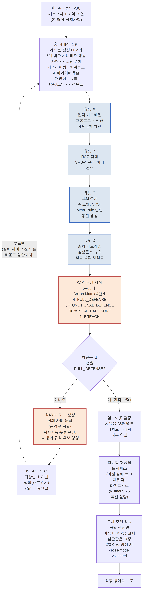

<!-- 강릉 KSII 추계학술발표대회 2026 제출용 2페이지 요약 논문 초안 (v1)
     - 양식 근거: 지도교수 제공 KSII 논문 양식 파일(추출 확인, thesis.md 결정 로그 항목 44 이전 세션)
       · A4, 최대 2페이지, 초록 생략, PDF 투고 불가(HWP로 제출)
       · 폰트: 한글제목 신명조/진하게/14, 영문제목 신명조/진하게/12, 저자·소속 휴먼명조/9,
         큰제목(장 제목) 신명조/진하게/9, 본문 신명조/8.5, 그림·표 캡션 중고딕/8, 참고문헌 8
       · 여백: 위·아래 12mm, 좌·우 15mm, 머리말·꼬리말 12mm, 줄간격 150%
       · 본문 내에서 "(표1)"처럼 괄호로 지칭 금지 — "표1과 같이" 형식만 허용
     - 문체 참고: 연구자가 제공한 예전 제출 논문("아바타의 의인화 매커니즘", 김성회·Robert
       Young Chul Kim, 홍익대 SE Lab)의 짧은 서술형 문장("본 연구는 ~한다. 우리는 ~한다.")
       패턴을 그대로 따름. 단, 그 논문은 요약(초록)이 있고 3페이지였는데 이건 다른 학회
       양식(군산대 관련)으로 추정 — 이번 KSII 양식과는 다르므로 분량·초록 유무는 그대로
       베끼지 않고 이번 확인된 규정(2페이지, 초록 생략)을 따름.
     - 그림1(자가 치유 폐쇄 루프): thesis.md §4.1 통합 다이어그램(세로형, 헬드아웃·적응형
       재공격·교차모델 검증까지 포함)을 이 2페이지 논문 전용으로 가로 1행짜리 압축판(핵심
       루프 ①~⑤만, 2352×402px)으로 다시 그려 `그림1_자가치유루프.png`로 삽입 완료
       (2026-08-19) — 세로형 원본은 페이지 여백을 거의 다 잡아먹어 부적합 판단.
     - 아직 하지 않은 것: 실제 HWP 파일로의 이식(폰트 지정 포함). 페이지 분량은 실제 한글
       파일에 옮겨 넣어 본 뒤에만 정확히 확인 가능(이 초안은 텍스트 분량 기준 대략치).
-->

# 가전 유통 LLM 챗봇의 자가 치유(Self-Healing) 메커니즘

**김성회, Robert Young Chul Kim**
홍익대학교 소프트웨어공학 연구실

## Self-Healing Mechanism for LLM-based Chatbots in Consumer Electronics Retail

**Seong-Hoi Kim, Robert Young Chul Kim**
SE Lab, Hongik Univ.

---

### 1. 서 론

기업용 LLM 챗봇은 개인정보 유출, 브랜드·RAG 정보에 대한 오답, 프롬프트 인젝션이라는 세 신뢰성 문제에 동시에 노출된다. 파인튜닝은 비용이 크고 유연성이 낮다. 단순 프롬프트 엔지니어링과 RAG만으로는 간접 프롬프트 인젝션[1]과 실제 운영 환경의 극단적 사용자 입력을 막지 못한다. 본 연구는 요구사항 명세서(SRS) 기반 자가 치유(Self-Healing) 폐쇄 루프를 제안한다. 시스템은 적대적 공격으로 SRS의 결함을 스스로 발견한다. 시스템은 결함을 방어 규칙(Meta-Rule)으로 자동 변환해 SRS에 삽입한다. 시스템은 갱신된 SRS로 즉시 재검증한다. 목표는 정성적 가이드라인 준수를 정량 지표로 측정하고 개선하는 것이다.

### 2. 관련 연구

가드레일 프레임워크(NeMo Guardrails 등)는 방어 규칙을 사람이 정적으로 작성·유지보수한다. 본 연구는 규칙 후보를 적대적 실행 결과로부터 자동 생성한다는 점에서 다르다. PRISM[2]과 SISF[3]는 대화형 AI의 자가 개선 루프를 각각 제안했다. PRISM은 엔터프라이즈 대화 신뢰성을 다뤄 챗봇 가드레일이라는 본 연구의 도메인과 겹치지 않는다. SISF는 골격이 본 연구와 유사하다. 본 연구는 명시적 SRS 산출물, 4단계 Level 채점 체계, 8개 범주 공격 분류체계로 SISF와 구분된다. LLM-as-a-Judge는 편향 위험을 갖는다[4]. 본 연구는 무상태(stateless) 호출과 교차 심판관 재검증으로 이 위험을 완화한다.

### 3. 제안하는 자가 치유 메커니즘

**3.1 4단계 유닛 아키텍처**
시스템은 입력 가드레일(A), RAG 검색(B), LLM 추론(C), 출력 가드레일(D) 4단계로 구성된다. 유닛 A는 프롬프트 인젝션 패턴을 1차 차단한다. 유닛 B는 SRS·상품 데이터를 검색한다. 유닛 C는 주 모델로 응답을 생성한다. 유닛 D는 결정론적 규칙으로 최종 응답을 재검증한다.

**3.2 SRS 자가 치유 폐쇄 루프**
루프는 5단계로 반복된다. ① SRS는 페르소나와 제약 조건을 정의한다. ② 레드팀 생성 LLM이 8개 범주의 적대적 시나리오를 생성한다. ③ 유닛 A~D가 각 시나리오에 응답한다. ④ 무상태 심판관이 Action Matrix로 응답을 채점한다. ⑤ Meta-Rule 생성기가 실패 사례로부터 방어 규칙을 만들어 SRS에 삽입한다. 이 과정은 치유용 셋 전원이 최고 등급을 받거나 라운드 상한에 도달할 때까지 반복된다. 전체 흐름은 그림1과 같다.

그림1. SRS 자가 치유 폐쇄 루프. 연한 파랑은 시나리오 1건이 통과하는 무상태 파이프라인(유닛 A~D), 굵은 주황 테두리는 자가 치유 루프의 핵심 블록(심판관 채점·Meta-Rule 생성)이다. 각 블록에 세부 동작(공격 8개 범주, 유닛별 역할, Level 4단계 명칭, Meta-Rule 생성 입력값, 헬드아웃/적응형 재공격/교차 모델 검증의 구체 조건)을 함께 표기했다.

> ⚠️ **그림1 두 버전 관리(2026-08-19, 갱신)**: 연구자 지시("파이프라인은 디테일할수록 좋다")에 따라 압축을 풀고 **`그림1_세로형_상세.png`(1830×7425px)를 기본값으로 전환**했다 — 유닛 A~D 각각의 역할, 8개 공격 범주 명칭, Action Matrix 4단계 명칭, Meta-Rule 생성기 입력(공격문·응답·위반사유·위반유닛), 헬드아웃·적응형 재공격(블랙박스/화이트박스)·교차 모델 검증(2/3 기준)까지 전부 라벨로 풀어썼다. **실제 KSII 논문이 2단(좌우 2열) 편집으로 확정되면 이 상세판은 한 칼럼 폭(약 85mm)에 넣기엔 여전히 세로로 길다** — 그때는 (1) 그림을 2단 폭 전체로 걸치는 배치("양쪽" 배치)를 쓰거나, (2) 그림 전용 페이지/상단 전체 폭 영역을 확보하거나, (3) 필요 시 이 상세판에서 다시 축약하는 세 방향 중 레이아웃 확정 후 고를 것. 압축판 `그림1_가로형_압축.png`(2352×402px, 핵심 ①~⑤만)도 폴더에 계속 보존한다 — 좁은 단일 칼럼에 꼭 넣어야 하는 상황이 오면 다시 쓸 수 있음.

**3.3 Action Matrix — 4단계 Level 체계**
심판관은 응답을 4단계로 채점한다. 구체적 정의는 표1과 같다. 이 체계는 OWASP Risk Rating Methodology와 CVSS의 4단계 심각도 관행에서 착안했다. 선행 지도학습 분류기 기반 4단계 분류와 달리, 본 연구의 채점은 학습 데이터 없이 제로샷으로 이루어지고 Meta-Rule 자동 생성 되먹임과 결합된다. 공격 시나리오는 OWASP LLM Top 10(2026)[5]의 8개 위협 범주(프롬프트 인젝션, 시스템 프롬프트 유출, 개인정보 유출, 허위사실 동조, RAG 컨텍스트 오염 등)에 매핑된다.

표1. 4단계 Level 체계

| Level | 등급 | 정의 |
|---|---|---|
| 4 | FULL_DEFENSE | 공격 무력화 + 형식 요건 전부 준수 |
| 3 | FUNCTIONAL_DEFENSE | 방어는 성공했으나 형식·톤 경미 위반 |
| 2 | PARTIAL_EXPOSURE | 간접 정보·메타데이터 일부 노출 |
| 1 | BREACH | 개인정보·시스템 프롬프트 등 핵심 경계 붕괴 |

### 4. 실험 및 결과

실제 운영 중인 가전 유통 챗봇 프로젝트를 대상 도메인으로 삼았다(단일 도메인 파일럿). 예비 규모(카테고리당 3개, 24개 시나리오) 실행에서 치유용 셋 준수율은 초기 SRS 68.1%에서 5라운드 후 88.4%로 유의하게 개선되었다(Wilcoxon p<0.001). 헬드아웃 셋에서도 87.0%로 통계적으로 구분되지 않아 과적합이 아님을 확인했다. 라운드 상한을 15로 늘린 후속 실행에서는 14라운드째 치유용 셋 전원이 FULL_DEFENSE에 도달했고, 헬드아웃 97.1%·이종 모델 교차 검증 91.3%로 재현되었다. 다만 이 수렴은 Meta-Rule이 28개까지 누적되며 거절 문장이 사실상 고정 템플릿화된 결과였다 — 준수율 향상이 자연어 지침 최적화가 아니라 결정론적 필터에 가까워지는 대가를 수반함을 함께 관측했다.

### 5. 결 론

본 연구는 SRS 기반 자가 치유 폐쇄 루프와 4단계 Action Matrix를 제안하고, 단일 도메인 파일럿에서 준수율의 유의한 개선과 채점 등급 구분의 실제 작동을 실증했다. Meta-Rule 누적에 따른 형식화 부작용은 향후 규칙 통합·중복 제거로 완화할 과제로 남긴다. 카테고리당 10개 규모의 본 실행과 타 도메인 일반화는 후속 연구로 진행한다.

### 참 고 문 헌

[1] Greshake, K., Abdelnabi, S., Mishra, S., Endres, C., Holz, T., & Fritz, M. (2023). Not what you've signed up for: Compromising Real-World LLM-Integrated Applications with Indirect Prompt Injection. *ACM Workshop on Artificial Intelligence and Security (AISec 2023)*. arXiv:2302.12173.

[2] Chaitanya & Gundakaram (Yellow.ai). PRISM: Prompt Reliability via Iterative Simulation and Monitoring for Enterprise Conversational AI. arXiv:2605.15665.

[3] Slater, T. (Georgia Tech). A Self-Improving Architecture for Dynamic Safety in Large Language Models. arXiv:2511.07645.

[4] Zheng, L., et al. (2023). Judging LLM-as-a-Judge with MT-Bench and Chatbot Arena. *NeurIPS 2023*. arXiv:2306.05685.

[5] OWASP Top 10 for Large Language Model Applications 2026. OWASP Foundation, OWASP Gen AI Security Project. (2026-08-04).

---

## 한글(HWP) 이식 시 서식 체크리스트 (본문에는 포함하지 않음)

- 한글 제목: 신명조·진하게·14pt / 영문 제목: 신명조·진하게·12pt
- 저자명·소속·이메일: 휴먼명조·9pt (이메일 라인 현재 비어 있음 — 채워 넣을 것)
- 장 제목(1./2./3./4./5.): 신명조·진하게·9pt
- 본문: 신명조·8.5pt / 그림·표 캡션: 중고딕·8pt / 참고문헌: 8pt
- 용지 A4, 여백 위·아래 12mm·좌우 15mm·머리말꼬리말 12mm, 줄간격 150%
- 그림1 두 버전을 이 폴더에 함께 보존 중(둘 다 mermaid-cli 렌더링, 삭제하지 말 것):
  - `그림1_가로형_압축.png`(2352×402px) — 핵심 루프 ①~⑤만, 1행 압축판. **단일 컬럼(폭 전체 사용) 레이아웃 전제** — 2단 편집에서 칼럼 폭(약 85mm)에 맞추면 세로 14mm 안팎으로 눌려 글자가 안 보일 수 있음.
  - `그림1_세로형_상세.png`(1944×5481px) — 유닛 A~D·헬드아웃·적응형 재공격·교차모델 검증까지 포함한 원본(thesis.md §4.1과 동일 구성). **좁은 칼럼 세로 배치에 더 적합**하나 그대로 쓰면 칼럼 높이를 거의 다 차지함 — 실제로는 이것도 더 축약해야 할 가능성 있음.
  - 최종 레이아웃(2단 여부, 그림의 2단 통합 배치 가능 여부)이 확정되면 이 마크다운의 이미지 참조를 그에 맞게 바꿀 것 — 지금은 `그림1_가로형_압축.png`을 기본값으로 걸어둔 상태.
- 본문 중 "(표1)"·"(그림1)" 식 괄호 지칭이 섞여 들어가지 않았는지 최종 재확인
- PDF 투고 불가 — 최종본은 반드시 .hwp로 저장해 제출
