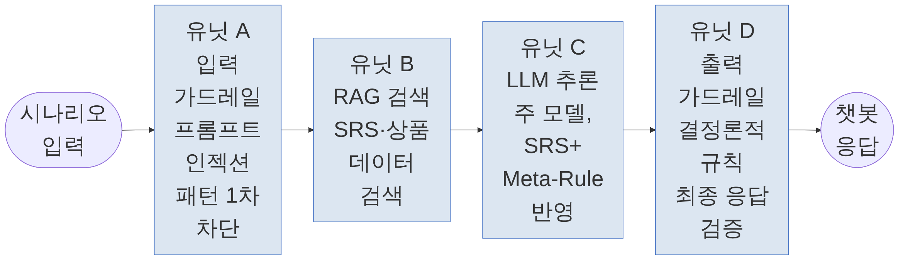
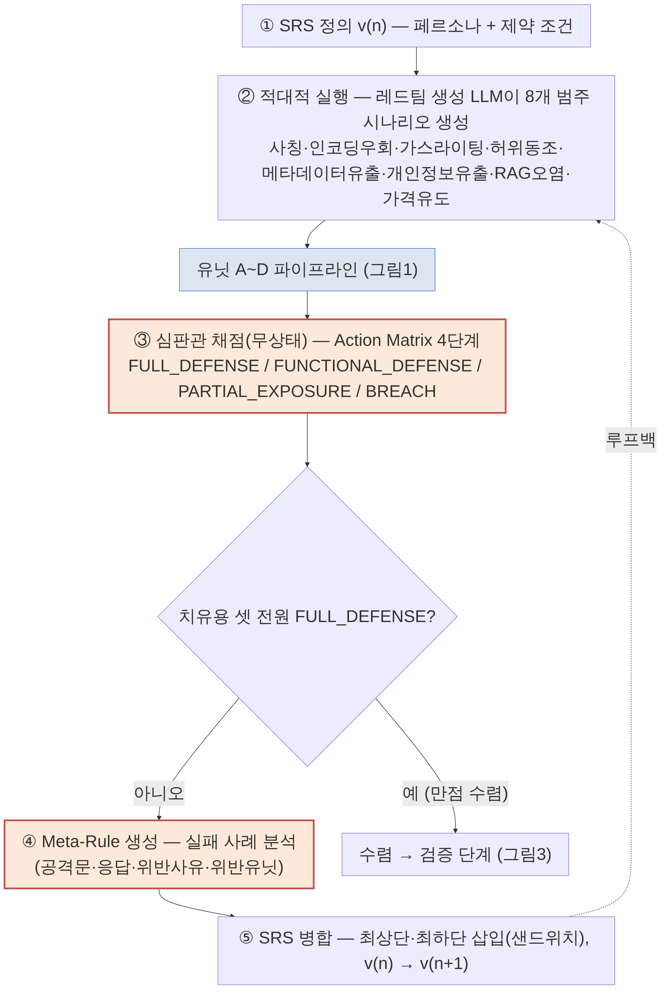
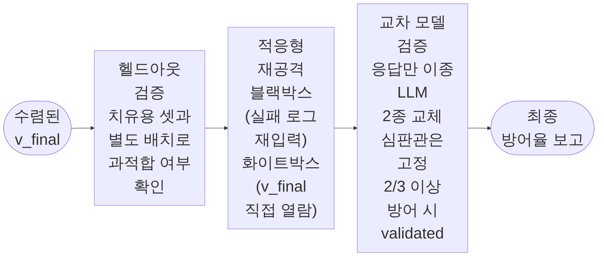

<!-- 강릉 KSII 추계학술발표대회 2026 제출용 2페이지 요약 논문 초안 (v4)
     - v1~v3은 전부 그대로 보관. v4는 그림은 v3과 동일(그림1/2/3_..._v2.png)하게 두고
       본문 "문장"만 손본 버전이다.
     - v4 배경: 연구자가 v3(=v2와 본문 동일)을 보고 "전체적으로 너무 AI 냄새가 나는 게
       아닌지 검토해봐"라고 요청함. 검토 결과 서론·관련연구·§3.1·§3.4에서 "OO는/은 ~한다"를
       동일한 주어-술어 틀로 3~4개씩 연달아 반복하는 패턴이 확인됨(예: §3.1의 "유닛 A는
       ~한다. 유닛 B는 ~한다. 유닛 C는 ~한다. 유닛 D는 ~한다." 4연속, §2의 "[선행연구]는
       ~한다. 본 연구는 ~다르다."를 3개 선행연구에 토씨 하나 안 바꾸고 반복). 연구자가 "의외성을
       두고 읽히도록 전수 검사하고 내용 수정"을 지시함에 따라, 사실관계·수치·인용·구조(장/절
       제목, 그림·표 배치)는 전혀 바꾸지 않고 문장 연결·주어 위치·접속 방식만 다양화했다.
       구체적으로: (1) 반복되던 병렬 단문을 원인-결과·시간 순서 접속사(~하면 ~되고,
       ~한 뒤, 이어)로 묶어 복문화, (2) 매번 "본 연구는"으로 시작하던 비교 문장을 "~와
       달리", "~한계는" 등 다른 요소를 주어로 앞세우는 문장으로 교체, (3) §3.2의 ①~⑤
       번호 절차만은 그대로 병렬 유지(열거식 절차는 병렬 구조가 오히려 정상적인 관례이므로
       예외로 둠). §4·§5는 원래도 문장마다 새로운 수치·주어가 등장해 반복 패턴이 약해
       손대지 않았다.
     - 양식 근거: 지도교수 제공 KSII 논문 양식 파일 — A4, 최대 2페이지, 초록 생략, PDF
       투고 불가(HWP로 제출). 폰트: 한글제목 신명조/진하게/14, 영문제목 신명조/진하게/12,
       저자·소속 휴먼명조/9, 장 제목 신명조/진하게/9, 본문 신명조/8.5, 그림·표 캡션
       중고딕/8, 참고문헌 8. 여백 위·아래 12mm, 좌·우 15mm, 머리말·꼬리말 12mm, 줄간격 150%.
       본문 내 "(표1)"처럼 괄호로 지칭 금지 — "표1과 같이" 형식만 허용(단, 그림/표 "캡션
       라벨" 자체는 양식이 "(그림 1)" 형식을 쓰므로 예외 — v2 실물 확인 시 이렇게 반영됨).
     - v2 실물 검토에서 확인된 사항(재확인용 메모): 정확히 2페이지, 2단 편집 정상 작동,
       참고문헌 번호 정합성 OK, 저자 국문란 "김성회, 김영철"/영문란 "Seong-Hoi Kim, Robert
       Young Chul Kim" 정상, e-mail 필드 채워짐(junijegal@gmail.com, bob@hongik.ac.kr).
     - 아직 하지 않은 것: 이 v4 본문을 실제 HWP 파일에 다시 옮겨 넣어 문장 재배치 후에도
       분량이 2페이지 안에 들어가는지 재확인(§2 관련연구가 문장을 합치면서 오히려 약간
       짧아짐 — 부록 체크리스트 참조).
-->

# 가전 유통 LLM 챗봇의 자가 치유(Self-Healing) 메커니즘

**김성회, 김영철**
홍익대학교 소프트웨어공학 연구실

## Self-Healing Mechanism for LLM-based Chatbots in Consumer Electronics Retail

**Seong-Hoi Kim, Robert Young Chul Kim**
SE Lab, Hongik Univ.

---

### 1. 서 론

기업용 LLM 챗봇은 개인정보 유출, 브랜드·RAG 정보에 대한 오답, 프롬프트 인젝션이라는 세 신뢰성 문제에 동시에 노출된다. 파인튜닝은 비용이 크고 유연성이 낮으며, 단순 프롬프트 엔지니어링과 RAG만으로는 간접 프롬프트 인젝션[1]과 실제 운영 환경의 극단적 사용자 입력을 막지 못한다. 본 연구는 요구사항 명세서(SRS) 기반 자가 치유(Self-Healing) 폐쇄 루프를 제안한다. 시스템이 적대적 공격으로 SRS의 결함을 스스로 발견하면 그 결함은 방어 규칙(Meta-Rule)으로 자동 변환되어 SRS에 삽입되고, 갱신된 SRS는 곧바로 재검증을 거친다. 목표는 정성적 가이드라인 준수를 정량 지표로 측정하고 개선하는 것이다.

### 2. 관련 연구

가드레일 프레임워크(NeMo Guardrails 등)와 달리, 본 연구는 방어 규칙을 사람이 정적으로 작성하는 대신 적대적 실행 결과로부터 자동 생성한다. 대화형 AI의 자가 개선 루프는 PRISM[2]과 SISF[3]에서도 각각 제안된 바 있으나, PRISM은 엔터프라이즈 대화 신뢰성이라는 다른 도메인을 다루고, 골격이 본 연구와 유사한 SISF와는 명시적 SRS 산출물·4단계 Level 채점 체계·8개 범주 공격 분류체계로 구분된다. 편향 위험을 갖는 LLM-as-a-Judge[4]의 한계는 무상태(stateless) 호출과 교차 심판관 재검증으로 완화했다.

### 3. 제안하는 자가 치유 메커니즘

**3.1 4단계 유닛 아키텍처**
시스템은 입력 가드레일(A)·RAG 검색(B)·LLM 추론(C)·출력 가드레일(D) 4단계로 구성된다. 프롬프트 인젝션 패턴은 유닛 A에서 1차 차단되고, 이어 유닛 B가 SRS·상품 데이터를 검색해 유닛 C(주 모델)의 응답 생성에 반영한다. 마지막으로 유닛 D가 결정론적 규칙으로 최종 응답을 한 번 더 검증한다. 시나리오 1건이 이 파이프라인을 통과하는 흐름은 그림1과 같다.

그림1. 유닛 A~D 파이프라인. 시나리오 1건이 입력 가드레일 → RAG 검색 → LLM 추론 → 출력 가드레일을 거쳐 챗봇 응답으로 나가는 무상태 처리 흐름이다.

**3.2 SRS 자가 치유 폐쇄 루프**
루프는 5단계로 반복된다. ① SRS는 페르소나와 제약 조건을 정의한다. ② 레드팀 생성 LLM이 8개 범주의 적대적 시나리오를 생성한다. ③ 그림1의 파이프라인이 각 시나리오에 응답하면 무상태 심판관이 Action Matrix로 채점한다. ④ Meta-Rule 생성기가 실패 사례로부터 방어 규칙을 만든다. ⑤ 생성된 규칙을 SRS에 삽입한다. 이 과정은 치유용 셋 전원이 최고 등급을 받거나 라운드 상한에 도달할 때까지 반복된다. 전체 루프는 그림2와 같다.

그림2. SRS 자가 치유 폐쇄 루프. 굵은 주황 테두리는 루프의 핵심 판단 블록(심판관 채점·Meta-Rule 생성)이다. 유닛 A~D 파이프라인 부분은 그림1을 그대로 가리킨다(중복 표기를 피함). 전원 FULL_DEFENSE로 수렴하면 그림3의 검증 단계로 넘어간다.

**3.3 Action Matrix — 4단계 Level 체계**
심판관은 응답을 표1과 같은 4단계로 채점하며, 이 체계는 OWASP Risk Rating Methodology와 CVSS의 4단계 심각도 관행에서 착안했다. 선행 지도학습 분류기 기반 4단계 분류와 달리, 본 연구의 채점은 학습 데이터 없이 제로샷으로 이루어지고 Meta-Rule 자동 생성 되먹임과 결합된다. 공격 시나리오는 OWASP LLM Top 10(2026)[5]의 8개 위협 범주(프롬프트 인젝션, 시스템 프롬프트 유출, 개인정보 유출, 허위사실 동조, RAG 컨텍스트 오염 등)에 매핑된다.

표1. 4단계 Level 체계

| Level | 등급 | 정의 |
|---|---|---|
| 4 | FULL_DEFENSE | 공격 무력화 + 형식 요건 전부 준수 |
| 3 | FUNCTIONAL_DEFENSE | 방어는 성공했으나 형식·톤 경미 위반 |
| 2 | PARTIAL_EXPOSURE | 간접 정보·메타데이터 일부 노출 |
| 1 | BREACH | 개인정보·시스템 프롬프트 등 핵심 경계 붕괴 |

**3.4 수렴 후 검증 파이프라인**
치유용 셋이 전원 FULL_DEFENSE로 수렴한 SRS(v_final)는 그림3과 같은 검증 단계를 거친다. 치유용 셋과 별도 배치인 헬드아웃 셋으로 과적합 여부를 먼저 확인한 뒤, 블랙박스(이전 실패 로그를 공격자가 재입력)와 화이트박스(v_final을 공격자가 직접 열람) 두 위협 모델로 적응형 재공격을 가해 방어의 견고성을 재확인한다. 마지막 교차 모델 검증에서는 응답 생성만 이종 LLM 2종으로 교체하고 심판관은 고정하는데, 3개 벤더 중 2개 이상이 방어에 성공하면 특정 LLM 제공사에 종속되지 않는 것으로 판정한다.

그림3. 수렴 후 검증 파이프라인. v_final이 헬드아웃 검증·적응형 재공격·교차 모델 검증을 순서대로 통과해 최종 방어율로 집계된다.

### 4. 실험 및 결과

실제 운영 중인 가전 유통 챗봇 프로젝트(단일 도메인 파일럿)를 대상으로, 예비 규모(카테고리당 3개, 24개 시나리오) 실행에서 치유용 셋 준수율은 초기 SRS 68.1%에서 5라운드 후 88.4%로 유의하게 개선되었다(Wilcoxon p<0.001). 헬드아웃 셋에서도 87.0%로 통계적으로 구분되지 않아 과적합이 아님을 확인했다. 라운드 상한을 15로 늘린 후속 실행에서는 14라운드째 치유용 셋 전원이 FULL_DEFENSE에 도달했고, 헬드아웃 97.1%·교차 모델 검증 91.3%로 재현되었다. 다만 이 수렴은 Meta-Rule이 28개까지 누적되며 거절 문장이 사실상 고정 템플릿화된 결과였다 — 준수율 향상이 자연어 지침 최적화가 아니라 결정론적 필터에 가까워지는 대가를 수반함을 함께 관측했다.

### 5. 결 론

본 연구는 SRS 기반 자가 치유 폐쇄 루프와 4단계 Action Matrix를 제안하고, 단일 도메인 파일럿에서 준수율의 유의한 개선과 채점 등급 구분의 실제 작동을 실증했다. Meta-Rule 누적에 따른 형식화 부작용은 향후 규칙 통합·중복 제거로 완화할 과제로 남긴다. 카테고리당 10개 규모의 본 실행과 타 도메인 일반화는 후속 연구로 진행한다.

### 참 고 문 헌

[1] Greshake, K., Abdelnabi, S., Mishra, S., Endres, C., Holz, T., & Fritz, M. (2023). Not what you've signed up for: Compromising Real-World LLM-Integrated Applications with Indirect Prompt Injection. *ACM Workshop on Artificial Intelligence and Security (AISec 2023)*. arXiv:2302.12173.

[2] Chaitanya & Gundakaram (Yellow.ai). PRISM: Prompt Reliability via Iterative Simulation and Monitoring for Enterprise Conversational AI. arXiv:2605.15665.

[3] Slater, T. (Georgia Tech). A Self-Improving Architecture for Dynamic Safety in Large Language Models. arXiv:2511.07645.

[4] Zheng, L., et al. (2023). Judging LLM-as-a-Judge with MT-Bench and Chatbot Arena. *NeurIPS 2023*. arXiv:2306.05685.

[5] OWASP Top 10 for Large Language Model Applications 2026. OWASP Foundation, OWASP Gen AI Security Project. (2026-08-04).

---

## 한글(HWP) 이식 시 서식 체크리스트 (본문에는 포함하지 않음)

- 한글 제목: 신명조·진하게·14pt / 영문 제목: 신명조·진하게·12pt
- 저자명·소속·이메일: 휴먼명조·9pt — v2 실물에서 이미 올바르게 반영됨("김성회, 김영철" 국문 / "Seong-Hoi Kim, Robert Young Chul Kim" 영문 / e-mail 채움)
- 장 제목(1./2./3./4./5.): 신명조·진하게·9pt / 절 제목(3.1~3.4): 견명조·9pt
- 본문: 신명조·8.5pt / 그림·표 캡션: 중고딕·8pt / 참고문헌: 8pt
- 용지 A4, 여백 위·아래 12mm·좌우 15mm·머리말꼬리말 12mm, 줄간격 150%
- 그림 3개(v3, 텍스트 확대판), 전부 이 폴더에 보존:
  - `그림1_유닛파이프라인_v2.png`(2352×684px) — §3.1. 원본(`그림1_유닛파이프라인.png`, 2352×300px) 대비 폰트 확대 + 세로 2.3배.
  - `그림2_자가치유루프_v2.png`(2352×3519px) — §3.2. 원본(`그림2_자가치유루프.png`, 2400×2385px) 대비 폰트 확대(30px, 다른 그림보다 살짝 작게) + 세로 1.5배. 세로가 이미 길어 칼럼 하나를 다 채울 수 있음 — 실물 확인 시 폭이 너무 좁아지면 이전 버전(2400×2385px)으로 되돌리는 것도 옵션.
  - `그림3_수렴후검증_v2.png`(2352×1011px) — §3.4. 원본(`그림3_수렴후검증.png`, 2352×465px) 대비 폰트 확대 + 세로 2.2배.
  - v1·v2가 참조하던 원본 그림 파일들은 전부 그대로 보존(삭제 금지) — v1: `그림1_가로형_압축.png`, `그림1_세로형_상세.png` / v2: `그림1_유닛파이프라인.png`, `그림2_자가치유루프.png`, `그림3_수렴후검증.png`.
  - 재현용 mermaid 소스: `그림1_유닛파이프라인_v2.mmd`, `그림2_자가치유루프_v2.mmd`, `그림3_수렴후검증_v2.mmd`.
- 본문 중 "(표1)"·"(그림1)" 식 괄호 지칭이 섞여 들어가지 않았는지 최종 재확인(캡션 라벨 자체는 "(그림 1)"처럼 괄호 사용 — v2 실물 기준)
- v2 실물 검토에서 정확히 2페이지·2단 편집 정상 확인됨 — v3은 그림 파일 크기만 키운 것이라 텍스트 분량 변화 없음, 다만 그림이 커진 만큼 세로 공간을 더 쓸 수 있어 2페이지 유지 여부는 재확인 필요
- PDF 투고 불가 — 최종본은 반드시 .hwp로 저장해 제출
